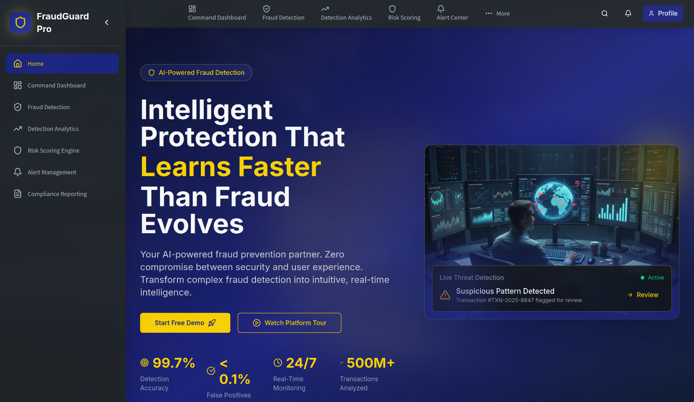

<div align="center">

# 🛡️ TechFiesta Fraud Guard

### AI-Powered Real-Time Fraud Detection System

[](https://python.org)
[](https://fastapi.tiangolo.com)
[](https://react.dev)
[](https://tailwindcss.com)
[](LICENSE)

**A cascaded machine learning system with 30 expert rules, Bayesian Neural Network, and XGBoost/LightGBM/CatBoost ensemble achieving 83% recall at 52% precision.**

[📖 Documentation](docs/ml-pipeline.md) • [🚀 Quick Start](#-quick-start) • [📡 API](docs/api-reference.md) • [🧠 ML Pipeline](docs/ml-pipeline.md)

</div>

---

<div align="center">



</div>

---

## 🎬 Demo Video

<div align="center">

[](https://www.youtube.com/watch?v=SU_U88xOyYg)

**[▶️ Watch Full Demo on YouTube](https://www.youtube.com/watch?v=SU_U88xOyYg)**

</div>

---

## 🚨 The Problem

Digital payment fraud is a **$50+ billion crisis** in 2025, with losses projected to exceed **$343 billion by 2027**. Traditional fraud detection systems face a critical flaw:

| Challenge | Traditional Systems | Our Solution |
|-----------|---------------------|--------------|
| **False Positive Rate** | 90-98% of alerts are false | 48% false positive rate |
| **Explainability** | ML black boxes | 30 interpretable rules |
| **Adaptability** | Rigid rule thresholds | Dynamic cascaded blending |
| **Precision** | 2-10% | **52%** |

> *Traditional AML systems waste compliance teams' time—up to 98% of alerts are non-fraudulent.*

**Our cascaded hybrid approach** combines the best of both worlds: explainable rules for instant decisions, ML for pattern recognition, and adaptive blending based on risk level.

> 📖 **[Full Problem Statement & Solution →](docs/problem-statement.md)**

---

## ⚡ Highlights

| Metric | Value | Description |
|--------|-------|-------------|
| **Recall** | 83.02% | Catches 83% of all fraud |
| **Precision** | 52.52% | Half of flagged transactions are true fraud |
| **F2-Score** | 74.38% | Recall-weighted performance metric |
| **AUC-ROC** | 89.00% | Excellent discrimination ability |

---

## 🎯 How It Works

```
Transaction → Rule Engine → BNN Risk Check → ML Ensemble → Decision
                  ↓                              ↓
            Hard Block (≥85%)           Cascaded Blending
```

1. **30 Expert Rules** instantly flag high-risk patterns (5.7% hard-blocked)
2. **Bayesian Neural Network** identifies gray-zone transactions
3. **3-Model Ensemble** (LightGBM 68%, XGBoost 24%, CatBoost 8%) makes final prediction
4. **Cascaded Blending** adjusts ML/Rules weight based on risk level

> 📖 **[Full Architecture →](docs/ml-pipeline.md)**

---

## 🚀 Quick Start

### Backend
```bash
cd Backend
pip install fastapi uvicorn pandas numpy joblib xgboost lightgbm catboost
python main.py  # Runs on http://localhost:8000
```

### Frontend
```bash
cd Frontend
npm install
npm run dev    # Runs on http://localhost:5173
```

> 📖 **[Detailed Installation →](docs/installation.md)**

---

## 📁 Project Structure

```
├── Backend/           # FastAPI REST API
│   ├── main.py        # /predict endpoint
│   ├── ml.py          # FraudInferenceSystem
│   └── models/        # Trained ML models (.joblib)
│
├── Frontend/          # React 19 + Vite Dashboard
│   └── src/pages/     # 8 dashboard modules
│
├── ML_Model_Training_Files/  # Training notebooks
│   └── TechFiesta_2026_...Training_Pipeline.ipynb
│
├── images/            # 📸 Dashboard Screenshots
│
└── docs/              # 📖 Detailed Documentation
    ├── problem-statement.md # Problem & solution context
    ├── ml-pipeline.md       # ML architecture
    ├── rules-engine.md      # 30 fraud rules
    ├── api-reference.md     # API docs
    └── installation.md      # Setup guide
```

---

## 📚 Documentation

| Document | Description |
|----------|-------------|
| [**Problem Statement**](docs/problem-statement.md) | Why this matters & our approach |
| [**ML Pipeline**](docs/ml-pipeline.md) | Complete 8-step training architecture |
| [**Rules Engine**](docs/rules-engine.md) | 30 expert rules across 9 tiers |
| [**API Reference**](docs/api-reference.md) | `/predict` endpoint documentation |
| [**Installation**](docs/installation.md) | Full setup instructions |

---

## 🖥️ Dashboard Pages

| Page | Route | Description |
|------|-------|-------------|
| Command Dashboard | `/command-dashboard` | Real-time monitoring |
| Detection Analytics | `/detection-analytics` | Fraud trends |
| Alert Management | `/alert-management-center` | Alert queue |
| Risk Scoring | `/risk-scoring-engine` | Risk tools |
| Fraud Form | `/fraud-detection-form` | Manual testing |

> 📸 **[View all screenshots →](images/)**

---

## 📄 License

MIT License - see [LICENSE](LICENSE) for details.

---

<div align="center">

**Built with ❤️ for TechFiesta 2026**

</div>
